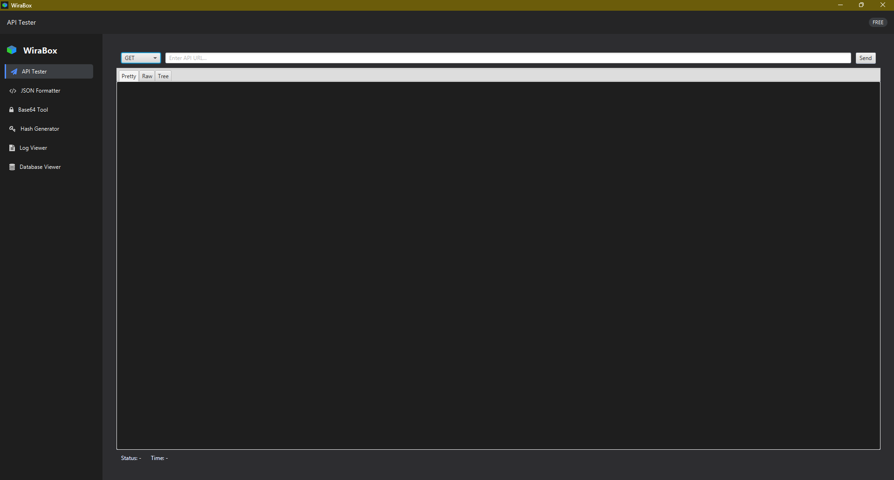
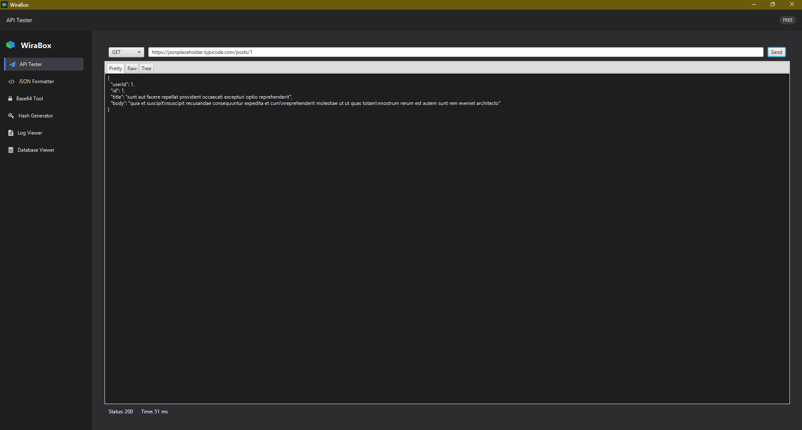
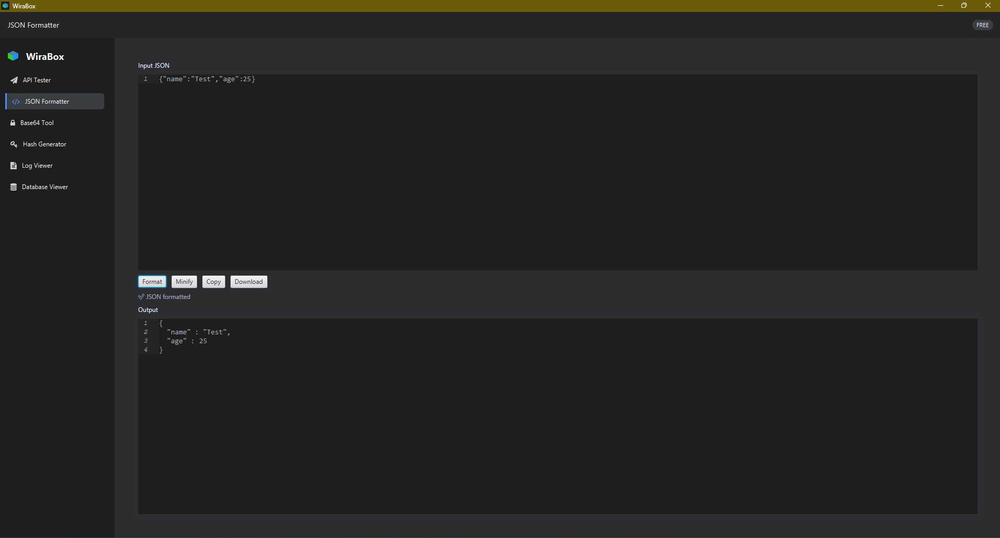
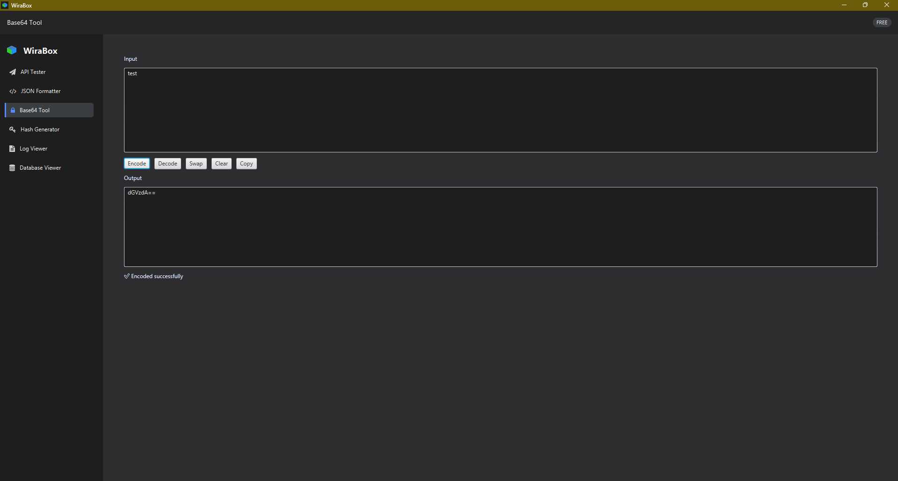
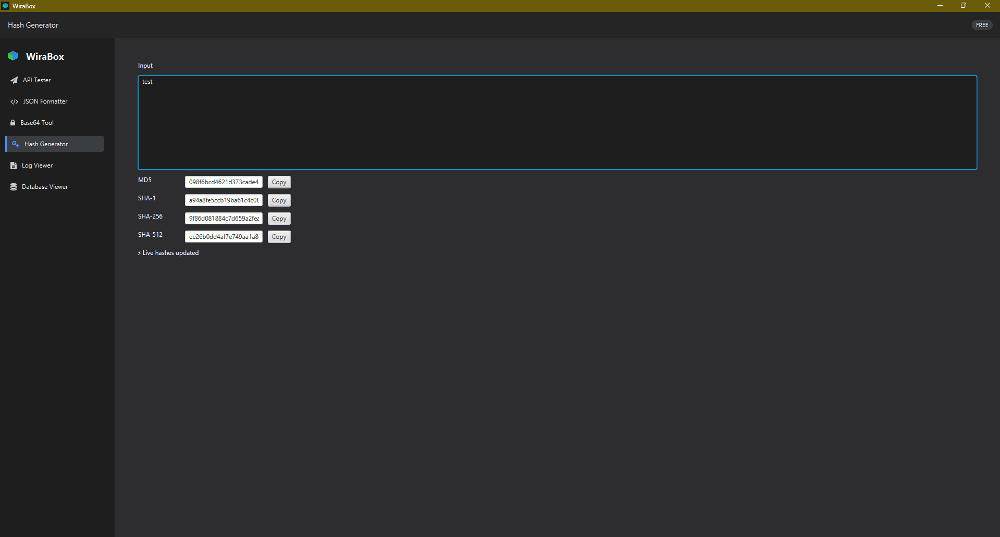
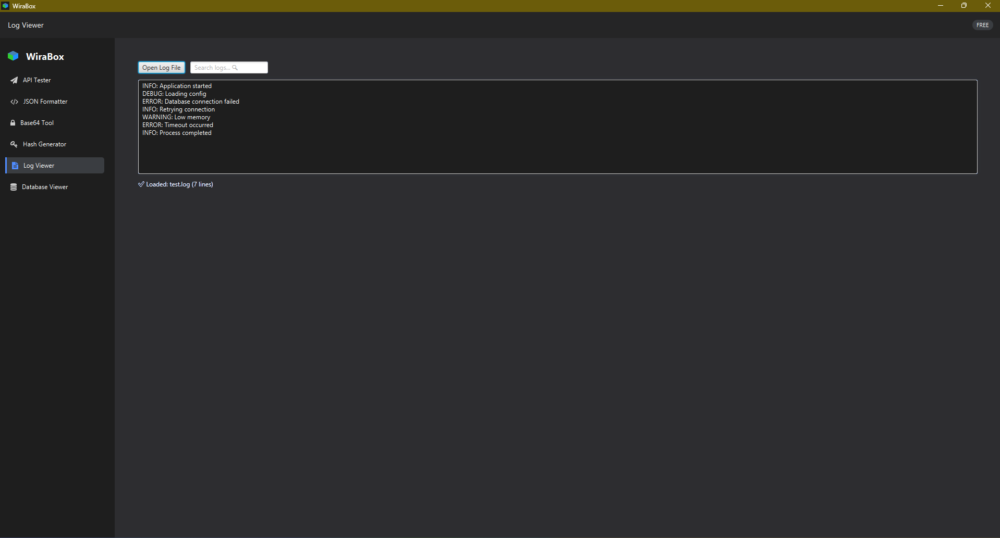
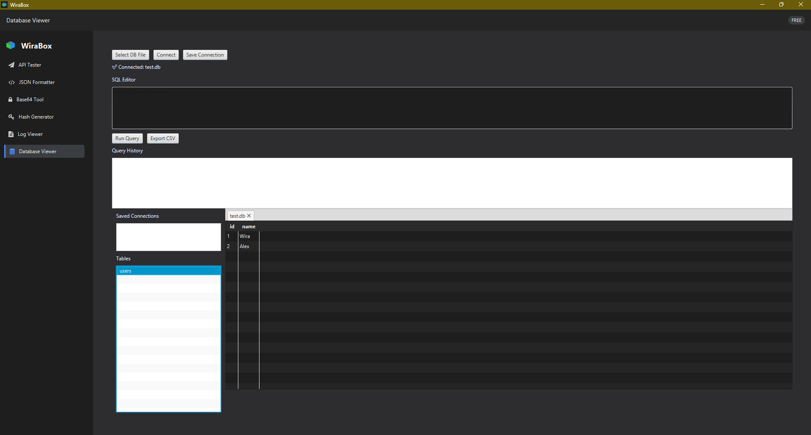

# 🚀 WiraBox — Developer Tool Suite
> A modern all-in-one desktop toolkit for developers — built with JavaFX.

WiraBox is a modern desktop developer toolkit built with JavaFX, designed to streamline common developer workflows in a clean, fast, and responsive UI.

> ⚡ Built with clean architecture, real-world engineering practices, and developer experience in mind.

---

## ✨ Features

### 🌐 API Tester
- Supports GET, POST, PUT, DELETE
- Pretty / Raw / Tree JSON views
- Response time tracking
- Async requests (no UI freeze)

### 🧾 JSON Formatter
- Syntax highlighting editor
- Format / Minify JSON
- Validation with error feedback
- Copy & Download support

### 🔐 Base64 Tool
- Encode / Decode instantly
- Swap input/output
- Copy results

### 🔑 Hash Generator
- MD5, SHA-1, SHA-256, SHA-512
- Live hash updates
- Copy support

### 📜 Log Viewer
- Load and analyze log files
- Live search with debouncing
- Highlight matches
- Log level detection (ERROR / WARN / INFO)

### 🗄 Database Explorer (Advanced)
- SQLite database connection
- Table browsing with dynamic schema
- SQL query execution
- Query history system
- CSV export
- Saved connections
- Multi-tab support

---

## 📸 Screenshots

### 🖥 Dashboard


### 🌐 API Tester


### 🧾 JSON Formatter


### 🔐 Base64 Tool


### 🔑 Hash Generator


### 📜 Log Viewer


### 🗄 Database Explorer


---

## 🧠 Architecture

WiraBox follows **Clean Architecture** principles:
presentation → UI layer
infrastructure → services (API, DB, JSON)
domain → business logic
utils → reusable helpers


### ✅ Benefits
- No logic leakage
- Highly maintainable
- Easily scalable
- Real-world structure

---

## 🛠 Tech Stack

- Java 21
- JavaFX 21
- Gradle
- OkHttp (API client)
- Jackson (JSON processing)
- SQLite JDBC

---

## 🚀 Getting Started

### 1. Clone the repository
```bash
git clone https://github.com/WiraAFauzi/wirabox.git
cd wirabox
./gradlew run

🎯 What This Project Demonstrates
Clean architecture implementation
Desktop UI engineering with JavaFX
Async programming (non-blocking UI)
Dynamic data rendering
Developer tool design & UX thinking

💡 Future Improvements
Plugin system (extend tools)
REST collections (Postman-style)
Database schema editor
Cloud sync
Export/import workspaces

👨‍💻 Author
Wira Ahmad Fauzi

⭐ Support
If you found this project useful:

⭐ Star the repo
🍴 Fork it
🧠 Learn from it


